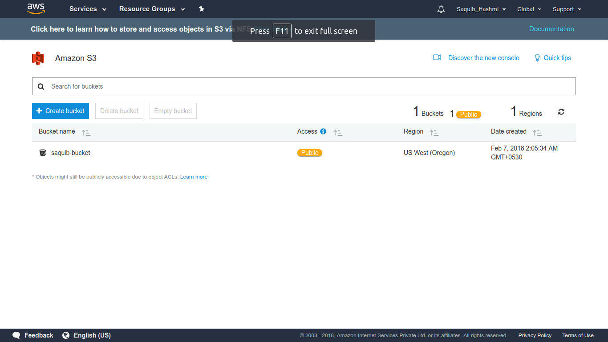
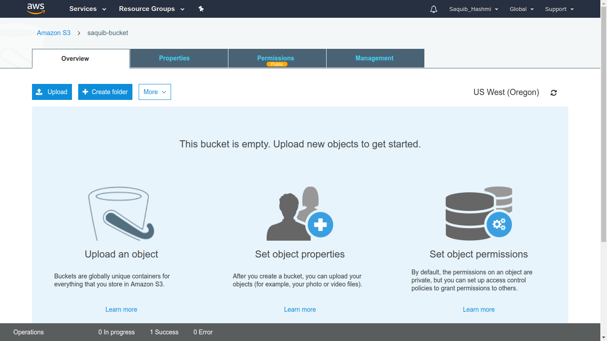
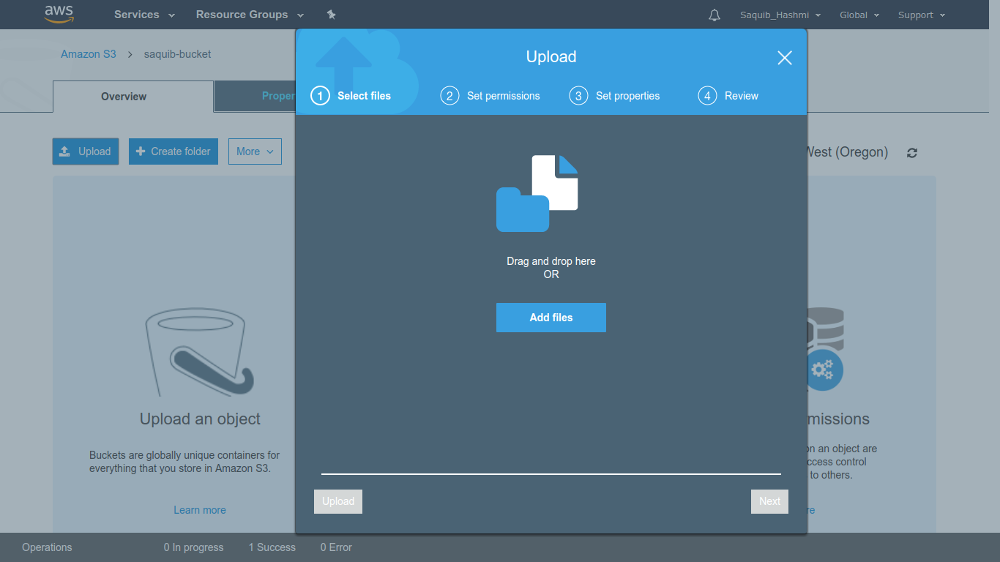
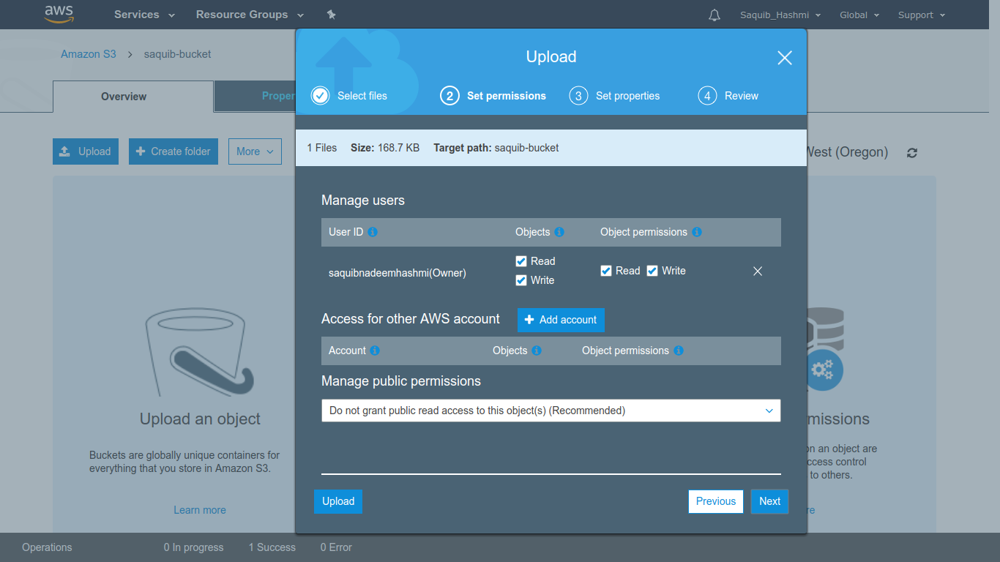
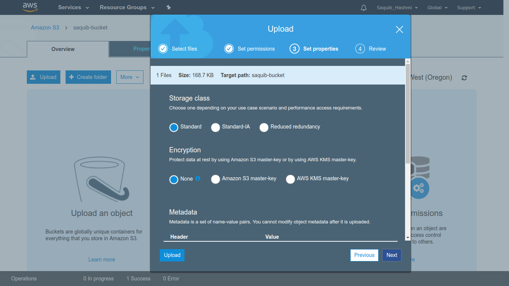
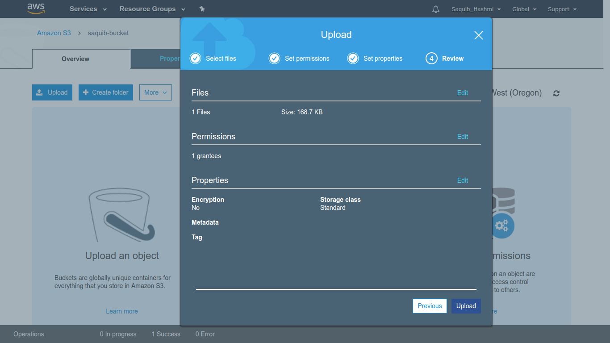

# AWS Rekognition

-  It is an image analysis and Recognition software which was built on top of deep learning technologies.
-  In image recognition through deep learning we try to recognize images through learning from data.
-  But with AWS Rekognize we can build scalable for image recognition apps without need to learn any deep learning technologies.

## It was released in ``2016``

- We need to give a picture and get back a json showing information about the picture.
- It is capable of doing face rekognition, object detection & localization, age analysis and many other things.

## Start with aws console
- Open aws
- Login to the console
- Search for Rekognition
- Click on ``Try Demo``
- Click on ``Upload`` a image to try with an image
    - **The Result** bar will show the accuracy for each class. 
    - Click the **Response** to see the **Result** in json.
    - 

## Start with aws CLI
- Create a aws S3 bucket
- 
- 
- 
- 
- 
- 

- ### Store the test image in the bucket
- 

- ### Refer [this link](https://www.youtube.com/watch?v=v33Kl-Kx30o) for S3 tutorial.
- Got to the terminal
    - The terminal should be configured with aws functionalities.
- Type --> ``aws rekognition detect-labels --image “S3Object={Bucket=name-of-bucket,Name=test.jpg}” --region us-west-2``
- Click ``Enter``

- This will show a response in json
``
LABELS	97.5228042602539	Cosmos
LABELS	89.71295166015625	Blossom
LABELS	89.71295166015625	Flora
LABELS	89.71295166015625	Flower
LABELS	89.71295166015625	Geranium
LABELS	89.71295166015625	Plant
LABELS	66.86774444580078	Crocus
LABELS	61.45215606689453	Daisies
LABELS	61.45215606689453	Daisy
LABELS	58.925926208496094	Aster
LABELS	55.03359603881836	Dahlia
LABELS	53.56421661376953	Petal
LABELS	50.99127960205078	Asteraceae
``

### To get help on other commands
- Type --> ``aws rekognition help``

### For Full video lecture go here : [The link](https://www.youtube.com/watch?v=-2C6-cSB674)
### Github Repo for the video : [Github](https://www.youtube.com/redirect?redir_token=6nBLd3jFXKc-FPVHBnEwRs_reph8MTUxODAzNzgxOUAxNTE3OTUxNDE5&v=f4NIuLb2QkI&q=https%3A%2F%2Fgithub.com%2Fdrpventura%2FPythonRekognitionDemo&event=video_description)
